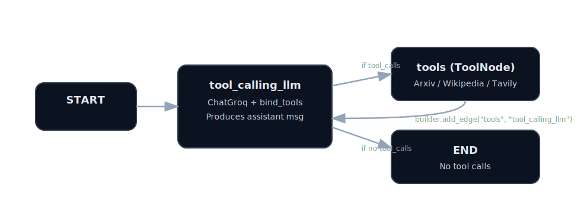

# Chat Bot (React + FastAPI + LangGraph + Groq Tools)

This repo is a simple “tool-using” chatbot:
- UI: React + Vite (`frontend/`)
- API server: FastAPI (`backend_app.py`)
- Orchestration: LangGraph state machine (`chatbot_logic/graph.py`)
- Model: Groq via `langchain-groq` (default model: `qwen/qwen3-32b`)
- Tools available to the model:
  - Arxiv search (`arxiv`)
  - Wikipedia (`wikipedia`)
  - Tavily web search (`TAVILY_API_KEY`)

## End-to-end flow (how it works)

1. You type a message in the React UI.
2. The UI calls the API `POST /api/chat` (served by `backend_app.py`) and sends your prompt + chat history.
3. `invoke_once()` runs a LangGraph loop:
   - `tool_calling_llm` node asks the LLM to respond (the LLM can decide to call tools).
   - If the LLM requests a tool call, the `tools` node runs Arxiv/Wikipedia/Tavily and returns results.
   - The graph loops back to `tool_calling_llm` so the LLM can produce the final answer using tool results.
   - If the LLM does **not** request any tool call, the graph ends and returns the assistant message.

Flowchart (the loop edge is `builder.add_edge("tools", "tool_calling_llm")`):

## Project layout

- `backend_app.py` — FastAPI server exposing `POST /api/chat`
- `frontend/` — React + Vite UI
- `chatbot_logic/graph.py` — LangGraph + tools + Groq model wiring
- `chatbotmultipletools.ipynb` — original notebook prototype
- `requirements.txt` — top-level dependencies (unpinned)
- `requirements.lock.txt` — pinned versions from the included local env
- `.env.example` — env var template

## Requirements

- Python 3.10+ recommended (your repo includes a local venv under `chatbot/`)
- API keys (see below)

## API keys / environment variables

Create a `.env` in the repo root (do not commit it). Start from `.env.example`.

Required:
- `GROQ_API_KEY` — used by `langchain-groq` to call Groq models
- `TAVILY_API_KEY` — used by the Tavily search tool

## Install dependencies (two options)

### Option A: Simple install (recommended for development)

1. Create/activate a virtualenv
2. Install:
   - `pip install -r requirements.txt`

### Option B: Reproducible install (pinned versions)

If you want versions pinned (to match the environment this repo was tested with):
- `pip install -r requirements.lock.txt`

## Run the app

### 1) Start the backend (FastAPI)

- `pip install -r requirements.txt`
- `uvicorn backend_app:app --reload --port 8000`

Backend health check:
- `curl http://localhost:8000/healthz`

### 2) Start the frontend (React)

In a second terminal:
- `cd frontend`
- `npm install`
- `npm run dev`

Open the Vite URL (usually `http://localhost:5173`).

Dev proxy:
- The frontend proxies `/api/*` to `http://localhost:8000` via `frontend/vite.config.ts`.

## Customizing the bot

In `chatbot_logic/graph.py`, update:
- Model: `BotConfig(model="...")`
- Tool settings: `arxiv_top_k_results`, `wiki_top_k_results`, `tool_doc_chars_max`

## Notes / gotchas

- If you see auth errors, double-check `.env` values and that they’re loaded in your shell (the code calls `load_dotenv()`).
- The repo previously included `.env` with real keys; rotate those keys and keep `.env` local.
